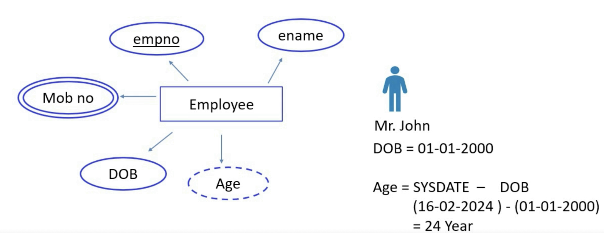
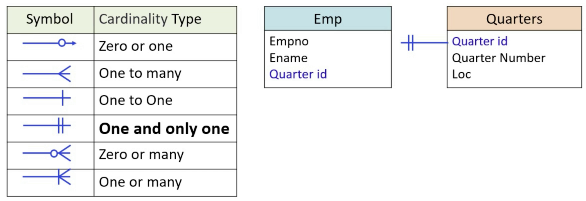

# ERD

Key terminologies to remember
1. ERD: Entity Relationship Diagram
..Kind of Data store in Database/Current System [ Flat files, Video Files, Row/Columns ] 
..Consumed information from source, type of
..Produced information for Target/downstream, type of
..Organization of relationships and data elements between 1st to 5th Normal Forms
..Define relationships between the elements of current elements within the system
..Cardinality, relationship of one->one OR one->Many or Many->Many
2. ODS: Operational Data Store. A place where data from heterogenous sources are stored. Data is retained for a longer period. 
3. Staging: An additional/optional area between ODS and Current system where data is validated and put into Current System. After data is writtent to current system, its truncated/removed.
4. Data Marts: Subsets of processed data from *Current System* created for the *Downstream applications*

Baseline for any system is the following representation of flow

Source{Upstream Process or System} -> Current System -> Target {DownStream Process or System}

#### Staging area or ODS
Operation Data Store, known very well in short as ODS, is the stage where data is stored between *Source* and *Current System*. 
*Stage" and "Staging" are two different terms. 

Source{Upstream Process or System} -> *[ODS]* ->  Current System -> Target {DownStream Process or System}

#### With change post validation into Staging area

Source{Upstream Process or System} -> *[ODS]* -> *[Staging]* -> Current System -> Target {DownStream Process or System}

#### With Data Marts between Current System and Target/DownStream 

Source{Upstream Process or System} -> *[ODS]* -> *[Staging]* -> Current System -> *[Data Marts {DM1, DM2} ]* ->  Target {DownStream Process or System}

## ERD: What are Objects/Entities
*Entity*: Representation of something we can see/feel or something that can be represented in a structured/semi-structured form, like within a table. Person/People, Cars/Aeroplanes, Events can be entities. 

*Attributes*: Also known as column(s) are one aspect of information that defines the Entity. Like "Number of Doors" for an Entity named Cars or Brand Name, or Price. 

### Types of Entities

*Strong* Entity: Any entity that is independent and does not have a dependency. Employee, Product, Customer are examples of Strong entity, in a ER Diagram, these are denoted by a rectangular box

*Weak* Entity: Entities that are dependent on *Strong* entitie(s), for instance, Sales depends on customers and cars, Dependents depends on Employee. These are denoted by twin rectangles witone inside another. 

*Associative* Entitye: Is a derived attribute from different entities which have a relationship. For instance, Project and Employee are two strong entities. Project.ID and Project.Name can be associated with Employee.ID and Employee.Name. As, an employee can be assigned a Project, there is an association_ID. A new type of entity can contain all this information like
  - Employee.ID
  - Employee.Name
  - Project.ID
  - Project.Name
  - Association.ID

  Associative entity are represented by a triangle within the rectangle. 

## Type of Attributes

#### Attribute Symbols
Attribute symbols, much like attribute themselves, define the characteristics of each attributes
- Circle and understore, denotes a primary key and independent attribute
- Cirle, denotes an independent attribute
- Two circles, one inside another denotes multiple values for one attribute, like two mobile numbers for one customer
- Dotted Circle is derived attribute, for instance *Age* is calculated by subtracting current_time minus DOB for the customer

## Cardinality
Number of instances within one entity which can be related to instance within another entity. The are six categories, here is a snapshot that shows these cardinalities altogether.

There are 6 types of cardinalities
1. Zero-to-One: One employee, one License number. Since an employee can have either one or ZERO license

2. One-to-many: One Department, Many Employees.

3. One: One employee, one passport

4. One-to-only-one: Each employee can only be given ONLY one quarters

5. Zero-or-many: Employee can have zero dependents or many

6. One-or-many: Can have at least one or many accounts (savings, EPF, current)

