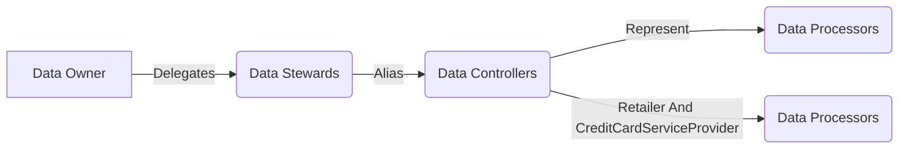

# Data Governance Notes
#### Data Owner: Entity that owns the data, for instance HR department owns all the HR data
     However, there is shared responsibiliy with other departments
     1. Human resources
     2. Information technology: Design & manage the systems which HR data will be operated/stored under
     3. Information security: Will secure, enforce integrity and confidentiality of the data
     4. Legal team: Will help keep tabs on the legal impacts associated with the data
     5. Data analytics: Protect quality and enable BUs to take decision




There are three key strcutures from the perspective of Data Governance.

```mermaid
graph LR
subgraph A
    A[Apex]
end
subgraph B
    B1[Level 1]
    B2[Level 1]
end
subgraph C
    C1[Level 2]
    C2[Level 2]
    C3[Level 2]
end
subgraph D
    D1[Level 3]
    D2[Level 3]
    D3[Level 3]
    D4[Level 3]
end
A --> B1
A --> B2
B1 --> C1
B1 --> C2
B2 --> C2
B2 --> C3
C1 --> D1
C1 --> D2
C2 --> D2
C2 --> D3
C3 --> D4
C3 --> D4
```


```
