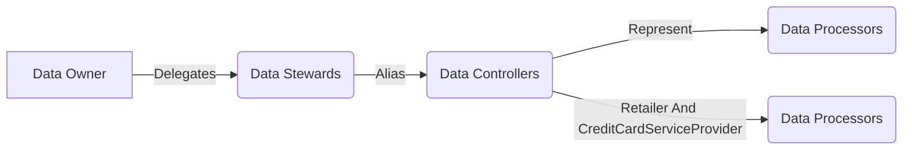
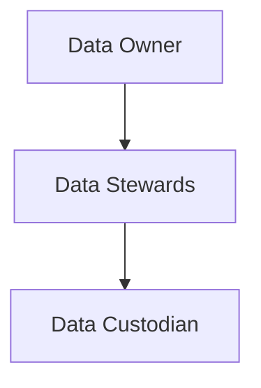
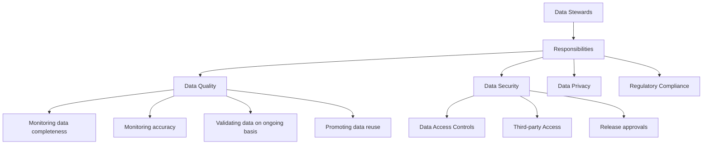

# Data Governance Notes
#### Data Owner: Entity that owns the data, for instance HR department owns all the HR data
     However, there is shared responsibiliy with other departments
     1. Human resources
     2. Information technology: Design & manage the systems which HR data will be operated/stored under
     3. Information security: Will secure, enforce integrity and confidentiality of the data
     4. Legal team: Will help keep tabs on the legal impacts associated with the data
     5. Data analytics: Protect quality and enable BUs to take decision

There are three key strcutures from the perspective of Data Governance.

## Traits of a good Data Steward
1. Good relationship with all the departments 
2. Great collaboration between different teams/orgs
3. Respected members to make tough calls on agreements about data access
4. Have SME functional knowledge about the data and its practices
5. Thorough understanding of data governance

## Responsibilities
1. Data Quality - Access to Data and its management requires clear data definitions, monitoring data completeness, monitoring accuracy, validating data on ongoing basis, promoting data reuse 
2. Data Security
3. Data Privacy
4. Regulatory Compliance 

