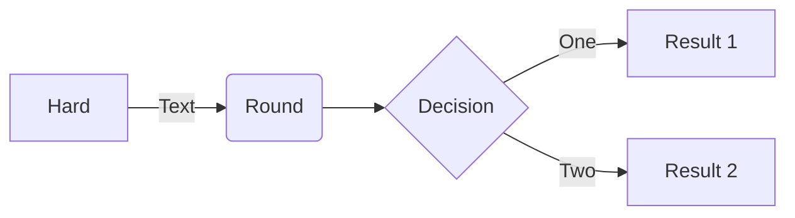

# Data Governance Notes
#### Data Owner: Entity that owns the data, for instance HR department owns all the HR data
     However, there is shared responsibiliy with other departments
     1. Human resources
     2. Information technology: Design & manage the systems which HR data will be operated/stored under
     3. Information security: Will secure, enforce integrity and confidentiality of the data
     4. Legal team: Will help keep tabs on the legal impacts associated with the data
     5. Data analytics: Protect quality and enable BUs to take decision

```mermaid
graph TD;
    Data-Owner-->|Delegation|-->Data_Stewards_1;
    Data-Owner-->|Delegation|-->Data_Stewards_2;
    Data-Owner-->|Delegation|-->Data_Stewards_n; 
    Data_Stewards_1-->|DataEnablers|-->Data_Controllers_x1;
    Data_Stewards_2-->|DataEnablers|-->Data_Controllers_a1;
    Data_Stewards_n-->|DataEnablers|-->Data_Controllers_e1;
```



