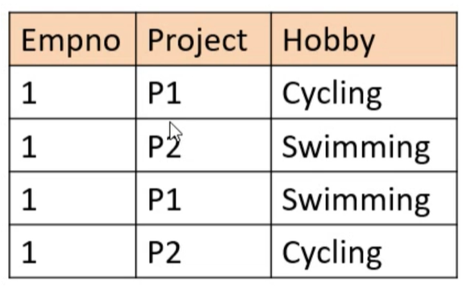

# Normalization

- Process of organlizing data inside the database
- Eliminate data redundancy and enhance data integrity
- Was first proposed by *Edgar F Codd* as part of relational model 

For instance, if a monolith table is broken down into multiple entities based on their relationship with each other based on key/attribute. Eg. Dept_ID in Departments table = Dept_ID in Employees table. 

#### Key Benefits
- Reduces storage space as redundant data is eliminated
- Ensures data integrity for instance, without a valid Dept_ID inside Department table, Employee.Dept_ID cannot have a new entry.
  [ This is ensured by integrity check ]
- Flexible so can accommodate more changes to the data


## Types of Normalization
####1. 1NF
.. A single column should hold single value for each row (atomic)
   | Emp No    | Name | Name   | HireDate   | Project              |
   | :---      |    :----: | :----:     | :----:     |  ---:                |
   | 1         | Thomas    | Jefferson  | 07/04/2024 | Project-1            |
   | 2         | John      | Kennedy    | 07/05/2022 | ~~Project-1, Project-2~~ |
   | 3         | Abe       | Lincon     | 07/04/2000 | Project-3            |

   Based on the above observation, Project-1 and Project-2 for *Emp No* 2 is non-atomic. Lets fix that

   | Emp No    | Name | Name   | HireDate   | Project              |
   | :---      |    :----: | :----:     | :----:     |  ---:                |
   | 1         | Thomas    | Jefferson  | 07/04/2024 | Project-1            |
   | 2         | John      | Kennedy    | 07/05/2022 | Project-1            |
   | 2         | John      | Kennedy    | 07/05/2022 | Project-2            |
   | 3         | Abe       | Lincon     | ~~Project-3~~  | ~~07/04/2000~~   |

   All other columns are duplicate for *Emp No* 2, however, now he has unique information for two separate Projects he was associated with.
   *Now* there is another problem with this representation i.e. HireDate has *Project-3* and Project column has "07/04/2000" as values. This conflicts with the principle of columns having       similar data. Lets fix that.

   | Emp No    | ~~Name~~ | ~~Name~~   | HireDate   | Project               |
   | :---      |    :----: | :----:     | :----:     |  ---:                |
   | 1         | Thomas    | Jefferson  | 07/04/2024 | Project-1            |
   | 2         | John      | Kennedy    | 07/05/2022 | Project-1            |
   | 2         | John      | Kennedy    | 07/05/2022 | Project-2            |
   | 3         | Abe       | Lincon     | 07/04/2000 | Project-3            |
   
   Above looks alright, however, fails the third characteristic of an attribute, each column must be unique. Lets fix this.

   | Emp No    | First Name| Last Name  | HireDate   | Project               |
   | :---      |    :----: | :----:     | :----:     |  ---:                |
   | 1         | Thomas    | Jefferson  | 07/04/2024 | Project-1            |
   | 2         | John      | Kennedy    | 07/05/2022 | Project-1            |
   | 2         | John      | Kennedy    | 07/05/2022 | Project-2            |
   | 3         | Abe       | Lincon     | 07/04/2000 | Project-3            |
   
.. Should always contain similar data
.. Name of a column should always be distinct


#### 2. 2NF
##### There are two main traits for 2NF these are 
1. It should have all the traits of 1NF
2. Column(s) should not have partial dependency

Lets look at an example 
   | Emp No    | Project   | Allocation | ProjectName|
   | :---      |  :----:   | :----:     | ----:      | 
   | 1         | P1        | 100        | Insurance  |
   | 2         | P2        |  25        | Mortgage   |
   | 2         | P3        |  75        | Banking    |
   | 3         | P1        | 100        | Insurance  |

In this example, we can see that EMP(1) + Project(P1) constitute a composite key, as they are unique when combined. Same goes for all the values within these two columns. And, column ProjectName depends on these columns. This is against 2NF, hence, this should be restructured and corrected or Normalized into two entities. 

*Employee*

   | Emp No    | Project   | Allocation |
   | :---      |  :----:   | ----:      | 
   | 1         | P1        | 100        |
   | 2         | P2        |  25        |
   | 2         | P3        |  75        |
   | 3         | P1        | 100        |

*Projects* Now the partial dependency of ProjectName column has been removed from the main table
   | Project   | ProjectName|
   | :---      | ----:      | 
   | P1        | Insurance  |
   | P2        | Mortgage   |
   | P3        | Banking    |
   

#### 3. 3NF
##### Again, two main traits for 3NF
1. Should always be in the 2NF form
2. Should not have any *transitive dependency*

Lets look at an example 
   | Emp No    | Name    | Dept_no    | Location   |
   | :---      |  :----: | :----:     | ----:      | 
   | 1         | Adam    | D10        | Delhi      |
   | 2         | Jason   | D05        | Mumbai     |
   | 2         | Michael | D19        | Chennai    |
   | 3         | George  | D11        | Hyderabad  |

In these columns, *Emp No* has a direct relation with *Dept_no* and *Dept_no* has a direct relation/dependency with *Location*. Here, there is a transitive dependency between Employee Number -> Dept_no -> Location. This is not allowed in 3NF, hence, to fox this, it can be normalized as the following entities:

Employee
   | Emp No    | Name    | Dept_no |
   | :---      |  :----: | ----:   | 
   | 1         | Adam    | D10     |
   | 2         | Jason   | D05     |
   | 2         | Michael | D19     |
   | 3         | George  | D11     |

Departments
   | Dept_no    | Location   |
   | :---      |  ----:      | 
   | D10        | Delhi      |
   | D05        | Mumbai     |
   | D19        | Chennai    |
   | D11        | Hyderabad  |


#### 4. 4NF
##### Key traits
1. Should conform to 3NF
2. Should not have multi-valued dependency

Conditions that create the issue for 4NF are
- More than one value depend on one key i.e. in the table we can see *EmpNo* is one key, but has multiple values i.e. "Project" and "Hobby" (primary or composite)
- Each value is independent of each other i.e. there is no relation between "Project" and "Hobby" attributes, but these columns depend on *Empno*

Lets look at our example


Lets try to join each employee with department number using the following table 

*emp_dept*
   | Empno    | Dept_no   |
   | :---     |  ----:    | 
   | 1        | 10        |

The SQL query would look like 
```SQL
select a.empno, a.project, b.dept_no from emp_project a join emp_dept b
       on a.empno = b.empno;
```

My output in this scenario have two set of duplicates
 
   | Empno    | Project |   Dept_no |       |
   | :---     | :----:  |  :----:   | ----: |
   | 1        | P1      |   10      | *Duplicate set1* |
   | 1        | P2      |   10      | *Duplicate set1* | 
   | 1        | P1      |   10      | *Duplicate set2* | 
   | 1        | P2      |   10      | *Duplicate set2* |


Lets try to fix this by decoupling the values from original table.

Employee_project
*projects*
   | Empno    | Project   |
   | :---     |  ----:    | 
   | 1        | P1        |
   | 1        | P2        |

Employee_hobby
*hobbies*
   | Empno    | Hobby     |
   | :---     |  ----:    | 
   | 1        | Swimming  |
   | 1        | Cycling   |

Now, lets see if we write our query to get the value using SQL, what does it look like

```SQL
select a.empno, a.project, b.dept_no from projects a join emp_dept b
       on a.empno = b.empno;
```

This is the result we should expect
   | Empno    | Project |   Dept_no |
   | :---     | :----:  |   ----:   |
   | 1        | P1      |   10      |
   | 1        | P2      |   10      | 


#### 5. 5NF   
##### Key traits
1. Should conform to 4NF
2. Should not have *joined dependency*


  | Empno | Project | Language |
  | :---  |  :---:  |     ---: |
  | 1     |  P1     | C        |
  | 2     |  P2     | C++      |
  | 1     |  P1     | Java     |
  | 3     |  P3     | VB       |
 

When more than one value depend on unique or composite key(s). In the above example, Project and Language depend on Employee Number (Empno) and Language and Project also depend on each other. 

In order to resolve this, the tables have to be broken down to isolate the dependencies


*Employee_Project*
  | Empno | Project |
  | :---  |  ---:   |
  | 1     |  P1     |
  | 2     |  P2     |
  | 3     |  P3     |


*Project_Lanugage*
  | Project | Language |
  | :---    |  ---:    |
  | P1      |  C       |
  | P1      |  Java    |
  | P2      |  C++     |
  | P3      |  VB      |


*Employee_Language*
  | Empno | Language|
  | :---  |  ---:   |
  | 1     |  C      |
  | 1     |  Java   |
  | 2     |  C++    |
  | 3     |  VB     |


